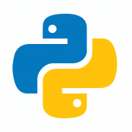

# 🐢***Dzeko***   

  <h2>✒️ Development Diary </h2>
  

  
 
  

  
<h2 align="center">⚔️ Tech Stack</h2>
<h3 align="center">Main</h3>

  

<h3 align="center">&</h3>

    

  

     

</a> </a>

    

  
<h2 align="center">📈 Algorithm Stats </h2>

  

  

  
 
                                                                   
<h2 align="center">💡 Git Stats 💡</h2>

    

               

